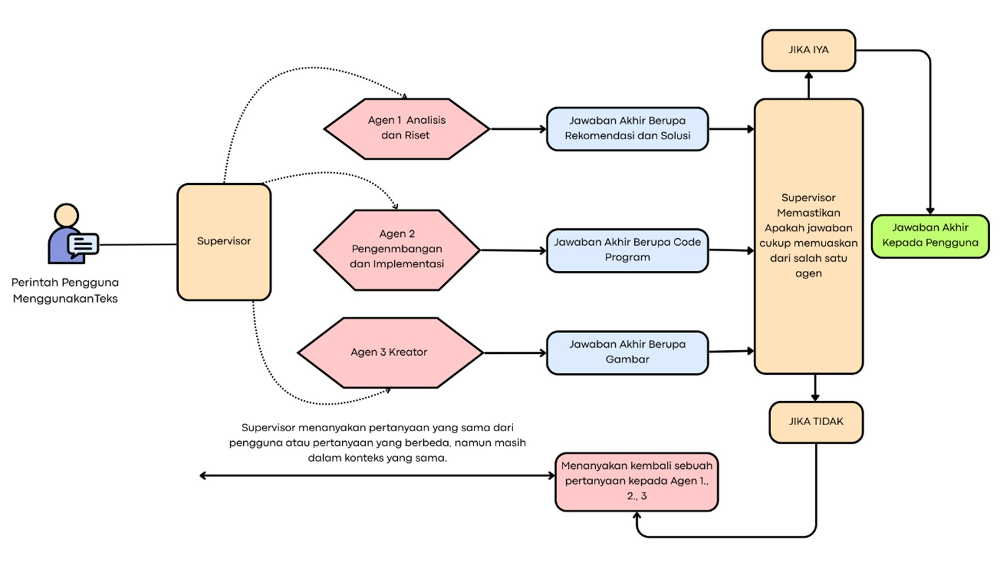

# DesignEnhancer

Selamat datang di **DesignEnhancer**! 🚀  
Proyek ini bertujuan untuk memperkuat alur kerja desain Anda dengan memanfaatkan kecerdasan buatan, memungkinkan Anda untuk meningkatkan kreativitas dan efisiensi dalam setiap langkah.

---

## ✨ Fitur Unggulan

- **Integrasi AI Canggih:** Otomatiskan dan tingkatkan proses desain dengan model-model AI terkini.
- **Multi-Agent System:** Kolaborasi antar agen AI untuk hasil analisis dan solusi yang lebih komprehensif.
- **Ekstensi Mudah:** Struktur kode modular, mudah dikembangkan sesuai kebutuhan Anda.
- **Antarmuka Interaktif:** UI/UX yang ramah pengguna untuk pengalaman desain yang menyenangkan.
- **Open Source & Komunitas:** Siapapun bisa berkontribusi, belajar, dan berkembang bersama.

---

## 🚀 Demo Cepat

1. **Clone & Jalankan dalam 5 Menit!**
2. **Coba fitur-fitur AI langsung di aplikasi web.**
3. **Kembangkan ide Anda bersama komunitas!**

---

## 🛠️ Memulai

Ikuti langkah-langkah di bawah ini untuk mengatur dan menjalankan proyek DesignEnhancer di mesin lokal Anda.

### 1. Kloning Repositori
```bash
git clone https://github.com/ShiroKatsuya/calista_application.git
cd calista_application
```

### 2. Konfigurasi Variabel Lingkungan

Buat file `.env` di direktori root proyek dan tambahkan baris-baris berikut:

```bash
export MODEL_ANALISIS_PENYEBAB="llama3-2.3b:latest"
export MODEL_ANALISIS_DAMPAK="llama3.2:3b"
export MODEL_MENGUSULKAN_SOLUSI="hf.co/unsloth/Qwen3-1.7B-GGUF:Q4_K_M"
export MODEL_SYNTHESIZER="hf.co/unsloth/gemma-3n-E2B-it-GGUF:Q4_K_M"
export MODEL_RISET="llama3-2.3b:latest"
export MODEL_IMPLEMENTASI="qwen2.5:1.5b"
export MODEL_SUPERVISOR="hf.co/unsloth/Qwen3-1.7B-GGUF:Q4_K_M"
export MODEL_REALTIME="gemini-2.5-flash"
export MODEL_IVR="gemma1b_v1:latest"
export HORIZON_BETA=""
export GEMINI_API_KEY="YOUR_GEMINI_API_KEY"
export SERPER_API_KEY="YOUR_SERPER_API_KEY"
export NEBIUS_API_KEY="YOUR_NEBIUS_API_KEY"
export GOOGLE_API_KEY="YOUR_GOOGLE_API_KEY"
export CALISTA_API_KEY="YOUR_CALISTA_API_KEY"
export GEMINI_MODEL="gemini-2.5-flash"
export IMAGE_GENERATION="stability-ai/sdxl"
export EMBED_MODEL="models/embedding-001"
export HUGGING_FACE_HUB_TOKEN="YOUR_HUGGING_FACE_HUB_TOKEN"
```

Ganti `YOUR_GEMINI_API_KEY`, `YOUR_SERPER_API_KEY`, `YOUR_NEBIUS_API_KEY`, `YOUR_GOOGLE_API_KEY`, `YOUR_CALISTA_API_KEY`, dan `YOUR_HUGGING_FACE_HUB_TOKEN` dengan kunci API Anda yang sebenarnya.

### 3. Instalasi Dependensi

Instal dependensi Python yang diperlukan:

```bash
pip install -r requirements.txt
```

Untuk instalasi `openai-whisper`:

**Windows:**
```bash
pip install git+https://github.com/openai/whisper.git
```

**macOS:**
```bash
openai-whisper
```

Untuk `torch`, pilih sesuai kebutuhan:

**CPU-only:**
```bash
pip install torch
```

**CUDA-enabled (untuk GPU NVIDIA):**
```bash
pip3 install torch torchvision torchaudio --index-url https://download.pytorch.org/whl/cu128
```

### 4. Menjalankan Aplikasi

Setelah semua dependensi terinstal, jalankan aplikasi dengan perintah berikut (pilih salah satu sesuai kebutuhan):

```bash
python app.py
# atau
python main_web.py
```

---

## 📸 Screenshot

Desain Arsitektur Berbasis Website dengan Pendekatan Multi‑Agen Spesialis




---

## 🤝 Kontribusi

Kami sangat antusias menyambut kontribusi dari komunitas!  
DesignEnhancer adalah platform open-source yang hidup, dan setiap baris kode, ide baru, atau laporan bug sangat berarti.

- **Fork** repositori ini dan buat pull request.
- **Laporkan bug** atau ajukan fitur baru melalui [Issues](https://github.com/ShiroKatsuya/calista_application/issues).
- **Diskusi & ide**: Gabung di forum atau grup komunitas kami (tambahkan link jika ada).

Lihat [CONTRIBUTING.md](CONTRIBUTING.md) untuk detail tentang cara memulai kontribusi Anda.

---

## ❤️ Mengapa Memilih DesignEnhancer?

- **Gratis & Open Source:** Tidak ada biaya, tidak ada batasan.
- **Komunitas Aktif:** Belajar dan berkembang bersama para inovator lain.
- **Dukungan Pengembangan:** Dokumentasi lengkap dan roadmap yang jelas.
- **Fleksibel:** Mudah diintegrasikan dengan workflow desain Anda.

---

## 📄 Lisensi

Proyek ini dilisensikan di bawah lisensi MIT.  
Lihat file `LICENSE` untuk detail lebih lanjut.

---

## ⭐ Dukung Proyek Ini!

Jika Anda menyukai proyek ini, jangan lupa untuk memberikan **star** di GitHub dan bagikan ke teman-teman Anda!  
Bersama kita bisa menciptakan masa depan desain yang lebih cerdas dan efisien.
